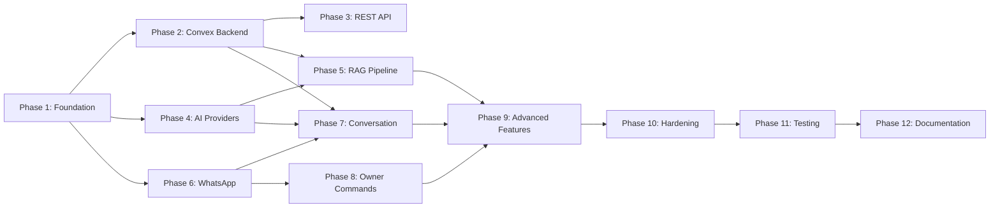
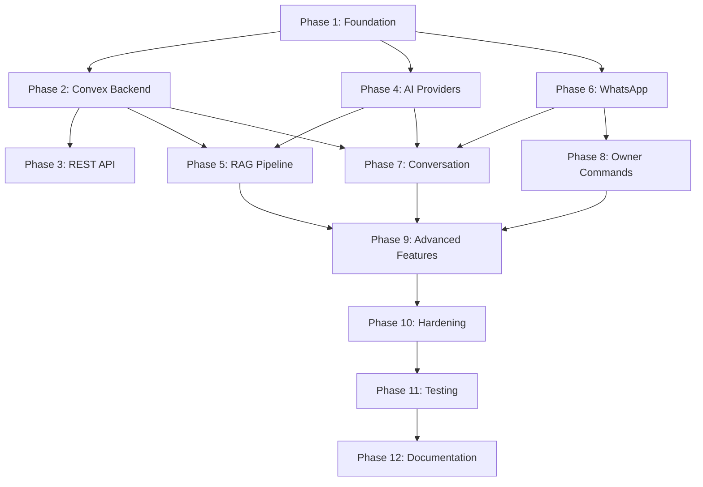

# CSCB Project — Detailed Implementation Plan

A step-by-step guide to building the Customer Service Chatbot from ground zero to a fully-featured multi-tenant production system.

> **Prerequisites:** Read [`docs/SOURCE_OF_TRUTH.md`](docs/SOURCE_OF_TRUTH.md) and [`docs/system_design.md`](docs/system_design.md) before starting.

---

## Overview

This plan breaks down the CSCB project into **12 phases**. Each step builds upon the previous one and includes verification and tests to ensure everything works before moving forward.



---

## Technology Stack

| Category             | Technology                      | Package                    |
| -------------------- | ------------------------------- | -------------------------- |
| **Runtime**          | Bun                             | —                          |
| **Language**         | TypeScript (strict)             | —                          |
| **WhatsApp**         | Baileys (multi-device)          | `@whiskeysockets/baileys`  |
| **AI (Primary)**     | DeepSeek V3                     | `openai`                   |
| **AI (Backup 1)**    | Google Gemini Flash             | `@google/genai`            |
| **AI (Backup 2)**    | Groq (Llama 3.1)                | `groq-sdk`                 |
| **Embeddings**       | Gemini (`gemini-embedding-001`) | `@google/genai`            |
| **Backend/Database** | Convex                          | `convex`                   |
| **Web Framework**    | Hono                            | `hono`                     |
| **Logging**          | Pino                            | `pino` + `pino-pretty`     |
| **Config**           | t3-env + Zod                    | `@t3-oss/env-core` + `zod` |
| **Process Manager**  | PM2                             | `pm2`                      |
| **Image Storage**    | Cloudflare R2                   | `@aws-sdk/client-s3`       |
| **Testing**          | Vitest                          | `vitest`                   |
| **Linting**          | Oxlint (type-aware)             | `oxlint`                   |
| **Formatting**       | Prettier                        | `prettier`                 |
| **Task Runner**      | Turborepo                       | `turbo`                    |

---

## Phase 1: Project Foundation & Basic Setup

### Step 1.1: Project Structure Setup

**Goal**: Create the foundational directory structure and configuration files.

**Tasks**:

- [ ] Create folder structure:
  ```
  src/
  ├── config/           # Environment, constants
  ├── providers/        # AI provider implementations
  ├── services/
  │   ├── whatsapp/     # Baileys client, sessions, QR
  │   ├── ai/           # Chat orchestrator, prompts, actions
  │   └── rag/          # Embeddings, vector search, context
  ├── controllers/      # Message + command handlers
  ├── commands/         # Individual ! commands
  ├── api/
  │   ├── middleware/   # Auth, CORS, rate-limit
  │   └── routes/       # CRUD endpoints
  └── utils/            # Logger, errors, language, currency
  convex/               # Convex schema, functions, seed
  tests/                # Test files mirroring src/
  docs/                 # Architecture docs
  ```
- [ ] Create `src/index.ts` as main entry point
- [ ] Initialize `package.json` with `bun init`
- [ ] Configure `tsconfig.json` with strict mode enabled
- [ ] Create `.gitignore` (node_modules, .env, logs/, data/, auth_sessions/)
- [ ] Install dev tooling: `bun add -d typescript bun-types vitest oxlint prettier turbo convex`
- [ ] Configure Oxlint (`oxlintrc.json`) with type-aware rules
- [ ] Configure Prettier (`.prettierrc` + `.prettierignore`)
- [ ] Configure Vitest (`vitest.config.ts`) with path aliases
- [ ] Create `convex/tsconfig.json` for Convex server functions
- [ ] Configure Turborepo (`turbo.json`) with task definitions, caching, and dependencies

**Turborepo Configuration** (`turbo.json`):

```json
{
  "$schema": "https://turbo.build/schema.json",
  "tasks": {
    "dev": {
      "persistent": true,
      "cache": false
    },
    "dev:server": {
      "persistent": true,
      "cache": false
    },
    "dev:convex": {
      "persistent": true,
      "cache": false
    },
    "typecheck": {
      "outputs": []
    },
    "lint": {
      "outputs": []
    },
    "test": {
      "outputs": ["coverage/**"]
    },
    "check": {
      "dependsOn": ["lint"]
    },
    "ci": {
      "dependsOn": ["typecheck", "lint", "test"]
    },
    "generate": {
      "cache": false
    }
  }
}
```

**Package Scripts** (all run via `bun`):

| Script                                  | Command                                      | Purpose                                     |
| --------------------------------------- | -------------------------------------------- | ------------------------------------------- |
| `bun dev`                               | `turbo run dev:server dev:convex --parallel` | Start dev server + Convex (via Turbo)       |
| `bun lint`                              | `oxlint --tsconfig tsconfig.json .`          | Type-aware linting (also reports TS errors) |
| `bun lint --fix`                        | `oxlint --tsconfig tsconfig.json --fix .`    | Apply autofixable lint fixes                |
| `bun check`                             | `turbo run check`                            | Format + lint                               |
| `bun test`                              | `vitest run`                                 | Run tests with Vitest (excludes evals)      |
| `bun test:watch`                        | `vitest`                                     | Watch mode for tests                        |
| `bun x vitest run path/to/test.test.ts` | —                                            | Run single test file                        |
| `bun generate`                          | `bunx convex codegen`                        | Generate Convex types after schema changes  |
| `bun run typecheck`                     | `tsc --noEmit`                               | TypeScript type checking                    |
| `bun run ci`                            | `turbo run ci`                               | Full CI: typecheck + lint + test (cached)   |

**Verification**:

- `bun run src/index.ts` starts without errors
- `bun run typecheck` passes with zero errors
- `bun lint` runs without configuration errors
- `bun run ci` passes (typecheck → lint → test)
- Directory structure exists as expected

**Tests**:

- Smoke test: application boots and exits cleanly

---

### Step 1.2: Environment Configuration

**Goal**: Set up type-safe, environment-based configuration management.

**Tasks**:

- [ ] Install `@t3-oss/env-core` and `zod`
- [ ] Create `src/config/env.ts` — type-safe env validation
- [ ] Validate required environment variables on startup with clear error messages
- [ ] Add default values for optional settings
- [ ] Create `.env.example` template file

**Configuration categories**:

```typescript
{
  // Convex
  CONVEX_URL: string,            // Convex deployment URL (auto-set by Convex CLI)

  // AI Providers
  AI_PROVIDER: "deepseek" | "gemini" | "groq",  // Active provider
  DEEPSEEK_API_KEY: string,
  DEEPSEEK_BASE_URL: string,
  GEMINI_API_KEY: string,
  GROQ_API_KEY: string,

  // Embeddings
  EMBEDDING_API_KEY: string,     // Gemini key for embeddings

  // Cloudflare R2
  R2_ACCOUNT_ID: string,
  R2_ACCESS_KEY_ID: string,
  R2_SECRET_ACCESS_KEY: string,
  R2_BUCKET_NAME: string,
  R2_PUBLIC_URL: string,         // Public bucket URL for serving images

  // API
  API_PORT: number,              // Default: 3000
  API_KEY: string,               // REST API authentication

  // General
  NODE_ENV: "development" | "production",
  LOG_LEVEL: "debug" | "info" | "warn" | "error",
}
```

**Verification**:

- Missing required env vars throw clear, descriptive error messages
- Config object is fully typed and accessible throughout app

**Tests**:

- Missing required var → throws `ConfigError`
- Invalid value (e.g., wrong enum) → throws with validation message
- Defaults applied when optional vars missing

---

### Step 1.3: Logging System

**Goal**: Implement structured logging with Pino.

**Tasks**:

- [ ] Install `pino` and `pino-pretty`
- [ ] Create `src/utils/logger.ts`
- [ ] Configure log levels based on environment (`dev` = debug, `prod` = info)
- [ ] Add pretty-printing for development
- [ ] Add log file output for production
- [ ] Implement sensitive data redaction (phone numbers, API keys)

**Verification**:

- Logs appear in console with proper formatting
- Log levels work correctly
- Sensitive data is redacted in output

**Tests**:

- Logger outputs at correct levels
- Redaction strips sensitive fields

---

### Step 1.4: Error Handling System

**Goal**: Create centralized error handling utilities.

**Tasks**:

- [ ] Create `src/utils/errors.ts` — custom error classes
- [ ] Create error types:
  - `ConfigError` — missing/invalid configuration
  - `DatabaseError` — connection or query failures
  - `AIError` — provider failures, timeouts
  - `WhatsAppError` — Baileys connection issues
  - `AuthError` — API authentication failures
  - `ValidationError` — input validation failures
- [ ] Add error formatting utilities (structured JSON for logging)
- [ ] Add error code constants

**Verification**:

- Custom errors contain proper metadata (code, message, cause)
- Errors log with full context via Pino

**Tests**:

- Each error type serializes correctly
- Error hierarchy works (instanceof checks)

---

### Step 1.5: PM2 Configuration

**Goal**: Configure PM2 to keep the bot alive on Windows.

**Tasks**:

- [ ] Install `pm2` globally
- [ ] Create `ecosystem.config.js` with:
  - Auto-restart on crash
  - Max memory restart threshold
  - Log file paths
  - Watch mode for development
- [ ] Create npm scripts: `start`, `dev`, `stop`, `logs`

**Verification**:

- `pm2 start ecosystem.config.js` launches the app
- App auto-restarts after a crash
- Logs accessible via `pm2 logs`

---

## Phase 2: Convex Backend Layer

### Step 2.1: Convex Project Setup

**Goal**: Initialize Convex and establish the project structure.

**Tasks**:

- [ ] Install `convex` package
- [ ] Run `npx convex dev` to initialize the `convex/` directory
- [ ] Create a Convex project (free tier) via the CLI
- [ ] Verify the `convex/` directory is created with `_generated/` types
- [ ] Add `CONVEX_URL` to `.env` (auto-populated by CLI)
- [ ] Create `convex/helpers.ts` for shared utility functions

**Verification**:

- `npx convex dev` connects to deployment successfully
- Auto-generated types available in `convex/_generated/`
- Dashboard accessible at `dashboard.convex.dev`

**Tests**:

- Convex client connects and responds to a simple query

---

### Step 2.2: Convex Schema Definition

**Goal**: Define the full schema using Convex's `defineSchema` and `defineTable`.

**Tasks**:

- [ ] Create `convex/schema.ts` with all tables:

**Companies Table**:

```typescript
companies: defineTable({
  name: v.string(),
  ownerPhone: v.string(),
  config: v.optional(v.record(v.string(), v.union(v.string(), v.number(), v.boolean()))),
  timezone: v.optional(v.string()),  // Default: "Asia/Aden"
})
.index("by_owner_phone", ["ownerPhone"]),
```

**Categories Table**:

```typescript
categories: defineTable({
  companyId: v.id("companies"),
  nameEn: v.string(),
  nameAr: v.optional(v.string()),
  descriptionEn: v.optional(v.string()),
  descriptionAr: v.optional(v.string()),
})
.index("by_company", ["companyId"]),
```

**Products Table**:

```typescript
products: defineTable({
  companyId: v.id("companies"),
  categoryId: v.id("categories"),
  nameEn: v.string(),
  nameAr: v.optional(v.string()),
  descriptionEn: v.optional(v.string()),
  descriptionAr: v.optional(v.string()),
  specifications: v.optional(v.record(v.string(), v.union(v.string(), v.number(), v.boolean()))),
  basePrice: v.optional(v.number()),
  baseCurrency: v.optional(v.string()),  // Default: "SAR"
  imageUrls: v.optional(v.array(v.string())),  // Cloudflare R2 public URLs
})
.index("by_company", ["companyId"])
.index("by_category", ["companyId", "categoryId"]),
```

**Product Variants Table**:

```typescript
productVariants: defineTable({
  productId: v.id("products"),
  variantLabel: v.string(),
  attributes: v.record(v.string(), v.union(v.string(), v.number(), v.boolean())),  // { size: "L", color: "White" }
  priceOverride: v.optional(v.number()),
})
.index("by_product", ["productId"]),
```

> [!NOTE]
> Variants inherit company scope through their parent product. Variant endpoints must validate company ownership via a join through `products`.

**Embeddings Table** (with vector index):

```typescript
embeddings: defineTable({
  companyId: v.id("companies"),
  productId: v.id("products"),
  embedding: v.array(v.float64()),
  textContent: v.string(),
  language: v.optional(v.string()),
})
.index("by_company", ["companyId"])
.index("by_product", ["productId"])
.vectorIndex("by_embedding", {
  vectorField: "embedding",
  dimensions: 768,  // Gemini embedding size
  filterFields: ["companyId", "language"],
}),
```

**Conversations Table**:

```typescript
conversations: defineTable({
  companyId: v.id("companies"),
  phoneNumber: v.string(),
  muted: v.optional(v.boolean()),  // Default: false
  mutedAt: v.optional(v.number()),
})
.index("by_company_phone", ["companyId", "phoneNumber"]),
```

**Messages Table** (separate from conversations for scalability):

```typescript
messages: defineTable({
  conversationId: v.id("conversations"),
  role: v.union(v.literal("user"), v.literal("assistant")),
  content: v.string(),
  timestamp: v.number(),
})
.index("by_conversation", ["conversationId"])
.index("by_conversation_time", ["conversationId", "timestamp"]),
```

**Offers Table**:

```typescript
offers: defineTable({
  companyId: v.id("companies"),
  contentEn: v.string(),
  contentAr: v.optional(v.string()),
  active: v.optional(v.boolean()),  // Default: true
  startDate: v.optional(v.number()),
  endDate: v.optional(v.number()),
})
.index("by_company_active", ["companyId", "active"]),
```

**Currency Rates Table**:

```typescript
currencyRates: defineTable({
  companyId: v.id("companies"),
  fromCurrency: v.string(),
  toCurrency: v.string(),
  rate: v.number(),
})
.index("by_company", ["companyId"])
.index("by_company_pair", ["companyId", "fromCurrency", "toCurrency"]),
```

**Analytics Events Table**:

```typescript
analyticsEvents: defineTable({
  companyId: v.id("companies"),
  eventType: v.string(),
  payload: v.optional(v.any()),
})
.index("by_company_type", ["companyId", "eventType"]),
```

- [ ] Run `npx convex dev` to push schema to deployment

**Verification**:

- All tables visible in Convex Dashboard
- Indexes created (including vector index on embeddings)
- Document references (`v.id()`) validated on insert
- Schema types auto-generated in `convex/_generated/`

**Tests**:

- Schema push runs without errors
- Insert documents with valid references → success
- Insert documents with invalid references → rejected

---

### Step 2.3: Sample Data Seeder

**Goal**: Create a seed script with realistic sample data for development and testing.

**Tasks**:

- [ ] Create `convex/seed.ts` as a Convex mutation
- [ ] Seed a sample company ("Demo Packaging Co")
- [ ] Seed 4-5 categories (Containers, Cups, Plates, Bags, Cutlery)
- [ ] Seed 15-20 products with bilingual names, descriptions, specs, and prices
- [ ] Seed 2-3 variants per product where applicable
- [ ] Seed 2 active offers
- [ ] Seed currency rate (SAR → YER at 425)
- [ ] Create a runner script to call the seed mutation

**Verification**:

- Seed mutation populates all tables (visible in Convex Dashboard)
- Data is bilingual and realistic
- Variants link correctly to products via `v.id("products")`

**Tests**:

- Seed runs idempotently (clears existing data before re-seeding)

---

### Step 2.4: Data Export / Backup

**Goal**: Leverage Convex's built-in data export for backups.

**Tasks**:

- [ ] Document how to use Convex Dashboard's snapshot export feature
- [ ] Create a script using Convex's export API for automated backups
- [ ] Save exports to a local `backups/` directory with timestamps
- [ ] Add retention policy (keep last N exports)

**Verification**:

- Export produces a complete snapshot of all tables
- Export can be imported to a fresh Convex deployment

---

## Phase 3: REST API

### Step 3.1: Hono Server Setup

**Goal**: Create the Hono web server alongside the main application.

**Tasks**:

- [ ] Install `hono`
- [ ] Create `src/api/server.ts` — Hono app initialization
- [ ] Create `src/api/middleware/auth.ts` — API key authentication
- [ ] Create `src/api/middleware/rateLimit.ts` — request rate limiting
- [ ] Configure CORS
- [ ] Configure JSON body parsing
- [ ] Start on configurable port (default 3000)

**Verification**:

- Server starts on configured port
- `GET /api/health` responds with status
- Requests without API key are rejected (401)
- Valid API key allows access

**Tests**:

- Health endpoint returns 200
- Missing auth header returns 401
- Invalid API key returns 403

---

### Step 3.2: Company Endpoints

**Goal**: Implement company (tenant) management endpoints.

**Tasks**:

- [ ] Create `src/api/routes/companies.ts`
- [ ] `GET /api/companies` — list all companies
- [ ] `GET /api/companies/:companyId` — get single company
- [ ] `POST /api/companies` — register new company
- [ ] `PUT /api/companies/:companyId` — update company config
- [ ] `DELETE /api/companies/:companyId` — delete company (cascades to all data)

**Verification**:

- All CRUD operations work
- Deletion cascades properly

**Tests**:

- CRUD lifecycle test
- Cascade delete removes products, conversations, etc.
- Validation rejects invalid input

---

### Step 3.3: Category Endpoints

**Goal**: Implement category CRUD scoped by company.

**Tasks**:

- [ ] Create `src/api/routes/categories.ts`
- [ ] `GET /api/companies/:companyId/categories` — list categories
- [ ] `GET /api/companies/:companyId/categories/:id` — get single
- [ ] `POST /api/companies/:companyId/categories` — create
- [ ] `PUT /api/companies/:companyId/categories/:id` — update
- [ ] `DELETE /api/companies/:companyId/categories/:id` — delete (fail if products exist)

**Verification**:

- All endpoints work correctly
- Delete returns 409 if category has products

**Tests**:

- Full CRUD cycle
- Delete with products → 409 conflict

---

### Step 3.4: Product Endpoints

**Goal**: Implement product CRUD with auto-embedding regeneration.

**Tasks**:

- [ ] Create `src/api/routes/products.ts`
- [ ] `GET /api/companies/:companyId/products` — list (with `?categoryId` and `?search` filters)
- [ ] `GET /api/companies/:companyId/products/:id` — get with variants included
- [ ] `POST /api/companies/:companyId/products` — create (auto-generate embeddings)
- [ ] `PUT /api/companies/:companyId/products/:id` — update (re-generate embeddings)
- [ ] `DELETE /api/companies/:companyId/products/:id` — delete (cascades embeddings + variants + R2 images)

**Verification**:

- All endpoints work
- Creating/updating a product triggers embedding generation
- Products return with their variants nested

**Tests**:

- CRUD lifecycle
- Filter by category
- Embedding auto-generation on create/update

---

### Step 3.5: Product Variant Endpoints

**Goal**: Manage product variants.

**Tasks**:

- [ ] Add to `src/api/routes/products.ts` (or separate `variants.ts`)
- [ ] `GET /api/companies/:companyId/products/:productId/variants` — list
- [ ] `POST /api/companies/:companyId/products/:productId/variants` — create
- [ ] `PUT .../variants/:id` — update (enforce company match via join)
- [ ] `DELETE .../variants/:id` — delete (enforce company match via join)

**Verification**:

- Variants link to correct product
- JSONB `attributes` stores flexibly

**Tests**:

- Create variant with simple attributes → success
- Create variant with complex attributes → success

---

### Step 3.6: Offers & Currency Rate Endpoints

**Goal**: Manage promotional offers and exchange rates.

**Tasks**:

- [ ] Create `src/api/routes/offers.ts`
  - `GET /api/companies/:companyId/offers` — list (default: active only, `?all=true` for all)
  - `POST /api/companies/:companyId/offers` — create
  - `PUT .../offers/:id` — update
  - `DELETE .../offers/:id` — delete
- [ ] Create `src/api/routes/currencyRates.ts`
  - `GET /api/companies/:companyId/currency-rates` — list
  - `PUT /api/companies/:companyId/currency-rates` — upsert rate

**Verification**:

- Offers filtered by active/inactive
- Currency rates stored and retrievable

**Tests**:

- Create offer with start/end dates
- Rate upsert (insert if not exists, update if exists)

---

### Step 3.7: Analytics Endpoint

**Goal**: Serve analytics summaries via API.

**Tasks**:

- [ ] Create `src/api/routes/analytics.ts`
- [ ] `GET /api/companies/:companyId/analytics?period=today|week|month`
- [ ] Aggregate from `analytics_events` table:
  - Total conversations
  - Total product searches
  - Image requests
  - Human handoffs
  - Average response time
  - Top searched products
- [ ] Return as structured JSON

**Verification**:

- Returns correct aggregations for each period filter

**Tests**:

- Empty data → returns zeros
- Seeded data → returns correct counts

---

### Step 3.8: Image Upload Endpoint

**Goal**: Upload product images via API using Cloudflare R2.

**Tasks**:

- [ ] Install `@aws-sdk/client-s3`
- [ ] Create `src/services/r2.ts` — R2 client setup using S3-compatible API
- [ ] Add `POST /api/companies/:companyId/products/:productId/images`
- [ ] Accept `multipart/form-data` with image file
- [ ] Upload to R2 bucket under key `{companyId}/{productId}/{uuid}.{ext}`
- [ ] Append the R2 public URL to product's `imageUrls` array
- [ ] Validate file type (JPEG, PNG, WebP only)
- [ ] Add `DELETE /api/companies/:companyId/products/:productId/images/:index` to remove single image
- [ ] On product delete, handle image cleanups asynchronously using Convex cron jobs or a background task queue

**Verification**:

- Image stored in R2 bucket
- URL appended to product record and publicly accessible
- Invalid file types rejected
- Product deletion cleans up R2 objects

**Tests**:

- Upload valid image → 201
- Upload invalid file type → 400
- Delete product → R2 objects scheduled for removal asynchronously

---

## Phase 4: AI Provider System

### Step 4.1: Provider Interface & Types

**Goal**: Define the pluggable AI provider contract.

**Tasks**:

- [ ] Create `src/providers/types.ts`:

  ```typescript
  interface AIProvider {
    readonly name: string;
    readonly model: string;
    chat(messages: ChatMessage[], options?: ChatOptions): Promise<ChatResponse>;
    isAvailable(): Promise<boolean>;
  }

  interface ChatMessage {
    role: "system" | "user" | "assistant";
    content: string;
  }

  interface ChatOptions {
    temperature?: number;
    maxTokens?: number;
    timeout?: number;
  }

  interface ChatResponse {
    content: string;
    usage?: { promptTokens: number; completionTokens: number };
    provider: string;
  }
  ```

**Verification**:

- Types compile without errors
- Interface is importable from anywhere

---

### Step 4.2: DeepSeek Provider

**Goal**: Implement the primary AI provider using OpenAI-compatible API.

**Tasks**:

- [ ] Install `openai` package
- [ ] Create `src/providers/deepseek.ts`
- [ ] Configure with DeepSeek base URL and API key
- [ ] Implement `chat()` with timeout and retry logic
- [ ] Implement `isAvailable()` health check

**Verification**:

- Simple prompt returns response
- Timeout works correctly
- Retries on transient failures (429, 500, 503)

**Tests**:

- Mock API → successful response parsed correctly
- Mock API → timeout triggers retry
- `isAvailable()` returns true/false correctly

---

### Step 4.3: Gemini Provider

**Goal**: Implement Google Gemini as backup AI provider.

**Tasks**:

- [ ] Install `@google/genai`
- [ ] Create `src/providers/gemini.ts`
- [ ] Use Gemini Flash model for fast, cheap responses
- [ ] Implement same `AIProvider` interface
- [ ] Handle Gemini-specific response format

**Verification**:

- Same prompt format works as DeepSeek
- Response mapped to `ChatResponse` correctly

**Tests**:

- Mock API → response parsed correctly
- Error handling works

---

### Step 4.4: Groq Provider

**Goal**: Implement Groq (Llama 3.1) as tertiary AI provider.

**Tasks**:

- [ ] Install `groq-sdk`
- [ ] Create `src/providers/groq.ts`
- [ ] Use Llama 3.1 8B model (cheapest, fastest)
- [ ] Implement same `AIProvider` interface

**Verification**:

- Response format matches other providers

**Tests**:

- Mock API → response parsed correctly

---

### Step 4.5: Provider Manager with Failover

**Goal**: Orchestrate providers with automatic failover chain.

**Tasks**:

- [ ] Create `src/providers/index.ts`
- [ ] Implement `ProviderManager`:
  - Load active provider from config
  - On failure → try next provider in chain
  - Chain: DeepSeek → Gemini → Groq → throw `AIError`
  - Log every failover event
- [ ] Export factory function: `createProviderManager(config)`

**Verification**:

- Primary provider used when healthy
- Failover triggers when primary fails
- All-fail throws meaningful error

**Tests**:

- Primary succeeds → uses primary
- Primary fails → falls back to secondary
- All fail → throws `AIError`
- Failover logged

---

### Step 4.6: System Prompts & Language Detection

**Goal**: Create the chatbot persona prompts and language utilities.

**Tasks**:

- [ ] Create `src/services/ai/prompts.ts`:
  - Base system prompt (business assistant persona)
  - Language-matched response instructions
  - Topic boundary rules (only business questions)
  - Hallucination prevention instructions
  - Action marker format (JSON in response for catalog/images/escalate)
  - Price negotiation behavior (configurable: STRICT / REDIRECT_OWNER / SHOW_RANGE)
- [ ] Create `src/utils/language.ts`:
  - Detect Arabic via Unicode ranges
  - Default to English for mixed content
  - Return `"ar"` or `"en"`

**Verification**:

- Arabic text detected as `ar`
- English text detected as `en`
- System prompt includes product context placeholder

**Tests**:

- Pure Arabic → `ar`
- Pure English → `en`
- Mixed → `en` (default)
- Numbers only → `en`

---

## Phase 5: RAG Pipeline

### Step 5.1: Gemini Embedding Service

**Goal**: Generate text embeddings using Gemini's embedding API.

**Tasks**:

- [ ] Create `src/services/rag/embeddings.ts`
- [ ] Use `gemini-embedding-001` model (768 dimensions)
- [ ] Implement `generateEmbedding(text: string): Promise<number[]>`
- [ ] Implement `generateBatchEmbeddings(texts: string[]): Promise<number[][]>`
- [ ] Add retry logic and error handling
- [ ] Add in-memory LRU cache for query embeddings (avoid re-embedding repeated queries)
- [ ] Have 2 backup embedding providers in case Gemini is down. No text fallback.

**Verification**:

- Embedding for English text returns 768-dimension vector
- Embedding for Arabic text returns 768-dimension vector
- Batch generation works
- Cached queries return instantly without API call
- Embedding API down → backup embedding provider returns results

**Tests**:

- Mock API → correct dimension output
- Empty string → handled gracefully

---

### Step 5.2: Product Embedding Generation

**Goal**: Generate and store embeddings for all products.

**Tasks**:

- [ ] Create embedding text template: combine `name + description + specs` for each language
- [ ] Generate embeddings for both Arabic and English versions of each product
- [ ] Store in Convex `embeddings` table using a mutation, scoped by `companyId`
- [ ] Create a Convex action to regenerate all embeddings
- [ ] Hook into product create/update API to auto-regenerate

**Verification**:

- All products have 2 embeddings (AR + EN)
- Re-running is idempotent (deletes old, creates new)

**Tests**:

- New product → 2 embeddings created
- Updated product → old embeddings replaced

---

### Step 5.3: Vector Search Service

**Goal**: Implement semantic product search using Convex's built-in vector search.

**Tasks**:

- [ ] Create `src/services/rag/vectorSearch.ts`
- [ ] Implement `search(query: string, companyId: string, limit?: number)`:
  1. Generate embedding for the query via Gemini
  2. Call `ctx.vectorSearch("embeddings", "by_embedding", { ... })` as a Convex action
  3. Filter by `companyId` using Convex's built-in filter expressions
  4. Return ranked product matches with `_score` similarity values
- [ ] Filter by similarity threshold on `_score` (configurable, default 0.3)

**Verification**:

- "food containers" finds relevant container products
- Arabic queries match Arabic product descriptions
- Results ordered by relevance (`_score`)
- Cross-company isolation works via `companyId` filter

**Tests**:

- Mock embedding → correct Convex vector search call
- Threshold filters low-relevance results

---

### Step 5.4: RAG Context Builder

**Goal**: Build AI context from search results.

**Tasks**:

- [ ] Create `src/services/rag/context.ts`
- [ ] Format product data into readable context string including:
  - Product name (in detected language)
  - Description
  - Specifications
  - Price (converted via company's currency rates)
  - Available variants
- [ ] Limit context size to stay within token limits
- [ ] Include "no products found" signal when search returns empty

**Verification**:

- Context includes relevant product details
- Prices converted correctly using company's rates
- Variants displayed under their product

**Tests**:

- Products with variants → variants listed
- Currency conversion applied correctly
- Empty search → appropriate message

---

### Step 5.5: RAG-Enhanced AI Responses

**Goal**: Integrate the full RAG pipeline into AI response generation.

**Tasks**:

- [ ] Create `src/services/ai/chat.ts` — the main orchestrator
- [ ] Pipeline:
  1. Detect language of user query
  2. Call vector search with query + company ID
  3. Build context from results
  4. Assemble messages: system prompt + context + conversation history + user query
  5. Call AI provider
  6. Return response with action markers (if any)
- [ ] Handle "no results found" gracefully

**Verification**:

- Product questions answered with real data from RAG
- Prices shown correctly in target currency
- Unknown products handled gracefully (bot says "I couldn't find...")
- Off-topic questions politely refused

**Tests**:

- Product query with matches → contextual response
- Product query with no matches → graceful fallback
- Off-topic → refusal response

---

## Phase 6: WhatsApp Integration

### Step 6.1: Baileys Client Setup

**Goal**: Initialize Baileys client with multi-device authentication.

**Tasks**:

- [ ] Install `@whiskeysockets/baileys`
- [ ] Create `src/services/whatsapp/client.ts`
- [ ] Configure with multi-device mode
- [ ] Persist authentication state to local directory (`auth_sessions/{companyId}/`)
- [ ] Handle connection events: `open`, `close`, `connecting`

**Verification**:

- QR code displays (terminal or image)
- After scanning, bot connects successfully
- Session persists across restarts

**Tests**:

- Connection state machine transitions correctly

---

### Step 6.2: Multi-Session Management

**Goal**: Manage multiple WhatsApp sessions (one per company).

**Tasks**:

- [ ] Create `src/services/whatsapp/session.ts`
- [ ] Implement `SessionManager`:
  - Start session for a company
  - Stop session for a company
  - Get session by company ID
  - List active sessions
- [ ] Store session metadata in database (`whatsapp_sessions` or `companies.config`)
- [ ] On app startup, reconnect all previously active sessions

**Verification**:

- Multiple sessions can run simultaneously
- Each session mapped to correct company
- Restart recovers all sessions

**Tests**:

- Start/stop session lifecycle
- Company isolation (messages routed to correct company)

---

### Step 6.3: QR Code Handling

**Goal**: Display QR codes for new session authentication.

**Tasks**:

- [ ] Create `src/services/whatsapp/qr.ts`
- [ ] Display QR code in terminal using ANSI art
- [ ] Save QR code as image to `data/qr/{companyId}.png`
- [ ] Expose QR via API: `GET /api/companies/:companyId/qr` (returns image)

**Verification**:

- QR displays in terminal
- QR image accessible via API endpoint

---

### Step 6.4: Message Receiving & Routing

**Goal**: Handle incoming WhatsApp messages.

**Tasks**:

- [ ] Create `src/controllers/message.ts`
- [ ] Listen to Baileys `messages.upsert` event
- [ ] Extract: sender number, message body, message type, quoted message
- [ ] Ignore: group messages, status updates, own messages
- [ ] Ignore: messages received while offline (check timestamp vs. boot time)
- [ ] Route to appropriate handler based on content:
  - `!` prefix → command handler
  - Text message → AI handler
  - Media message → polite decline
- [ ] Log all incoming messages

**Verification**:

- Text message → logged and routed to AI
- `!help` → routed to command handler
- Voice note → polite decline message
- Group message → ignored

**Tests**:

- Route text to AI handler
- Route `!` command to command handler
- Skip group messages
- Skip offline messages

---

### Step 6.5: Message Sending

**Goal**: Send text and media messages back to users.

**Tasks**:

- [ ] Add to `src/controllers/message.ts`: `sendText()`, `sendImage()`
- [ ] Handle message queuing to prevent WhatsApp rate limiting
- [ ] Add typing indicator (`composing` presence) before responding
- [ ] Simulate natural delay (1-3 seconds) before sending

**Verification**:

- Bot replies with text
- Bot sends images with captions
- Typing indicator visible to customer

**Tests**:

- Send text → message delivered
- Send image with caption → delivered

---

### Step 6.6: Access Control

**Goal**: Implement phone number-based access control per company.

**Tasks**:

- [ ] Create `src/services/accessControl.ts`
- [ ] Implement modes (read from company config):
  - `OWNER_ONLY` — only the owner's phone number
  - `SINGLE_NUMBER` — one specific number
  - `LIST` — approved numbers list
  - `ALL` — any number
- [ ] Check authorization before processing any message
- [ ] Identify owner for admin commands

**Verification**:

- `OWNER_ONLY` blocks non-owner
- `LIST` allows only approved numbers
- `ALL` allows everyone
- Owner always has access

**Tests**:

- Each mode tested with authorized and unauthorized numbers

---

### Step 6.7: Per-User Rate Limiting

**Goal**: Prevent abuse and respect WhatsApp limits.

**Tasks**:

- [ ] Create `src/services/rateLimiter.ts`
- [ ] Implement per-phone-number rate limiting
- [ ] Configure minimum interval between messages (default: 3 seconds)
- [ ] Queue messages that exceed limit (don't drop)
- [ ] Track via in-memory Map (reset on restart is acceptable)

**Verification**:

- Rapid messages from same user are throttled
- Messages eventually delivered (not dropped)
- Different users don't affect each other

**Tests**:

- Rapid messages → throttled
- Messages delivered after throttle period

---

## Phase 7: Conversation & Memory

### Step 7.1: Conversation Service

**Goal**: Manage per-user, per-company conversation history.

**Tasks**:

- [ ] Create `src/services/conversation.ts`
- [ ] Implement:
  - `getOrCreateConversation(phone, companyId)` — find or create conversation record
  - `getHistory(phone, companyId)` — query `messages` table by `conversationId`, ORDER BY `timestamp`, LIMIT N
  - `addMessage(conversationId, role, content)` — insert into `messages` table
  - `clearHistory(conversationId)` — delete all messages for conversation
  - `trimHistory(conversationId, maxMessages)` — delete oldest messages beyond limit
- [ ] Configure max history length (default: 20 messages)

**Verification**:

- History persists across messages
- Old messages trimmed when limit exceeded
- History scoped to company

**Tests**:

- Add message → persists
- Trim at limit → oldest removed
- Clear → empty array

---

### Step 7.2: Context Window Management

**Goal**: Include conversation history in AI context.

**Tasks**:

- [ ] Update `src/services/ai/chat.ts` to include conversation history
- [ ] Format history as `ChatMessage[]` array
- [ ] Handle quoted/reply messages (include original message as context)
- [ ] Balance history length vs. RAG context vs. token limits

**Verification**:

- Bot remembers previous messages in conversation
- Follow-up questions work without repeating context
- "What about the price?" after asking about a product → correct response

**Tests**:

- Follow-up question uses history
- History + RAG context stays within token limits

---

### Step 7.3: Conversation Timeout & Cleanup

**Goal**: Automatically expire stale conversations.

**Tasks**:

- [ ] Track `updatedAt` timestamp on every message
- [ ] On next message, check if conversation has timed out (configurable, default: 30 minutes)
- [ ] If timed out, start fresh conversation context
- [ ] Periodic cleanup of very old conversations (>7 days) from database

**Verification**:

- Message after timeout starts fresh context
- Old conversations cleaned from DB

**Tests**:

- Message within timeout → history preserved
- Message after timeout → fresh start

---

### Step 7.4: Welcome Message & Proactive Offers

**Goal**: Greet first-time customers and share active offers.

**Tasks**:

- [ ] Detect first-time customer (no existing conversation)
- [ ] **Idempotency guard**: encapsulate the "find or create" logic completely inside a single Convex mutation script to prevent duplicate welcomes from rapid concurrent messages
- [ ] Send welcome message template (bilingual)
- [ ] Query active offers for the company from `offers` table
- [ ] If offers exist, use AI to generate a natural promotional message from the offer data
- [ ] Send offer message as a second message after welcome
- [ ] Then proceed to answer the customer's actual query

**Verification**:

- First message → welcome + offer + answer
- Returning customer → just answer (no welcome again)
- No active offers → welcome + answer only

**Tests**:

- First-time customer → welcome sent
- Returning customer → no welcome
- Active offers → AI-generated offer message
- No offers → skipped gracefully

---

## Phase 8: Owner Commands

### Step 8.1: Command Parser

**Goal**: Parse owner commands (prefix: `!`).

**Tasks**:

- [ ] Create `src/controllers/command.ts`
- [ ] Detect `!` prefix in message
- [ ] Parse command name and arguments
- [ ] Validate sender is the company owner
- [ ] Route to matching command handler
- [ ] Return "unknown command" for invalid commands

**Verification**:

- `!help` → parsed correctly
- `!setrate SAR YER 425` → command="setrate", args=["SAR","YER","425"]
- Non-owner → rejected with message

**Tests**:

- Parse various command formats
- Owner validation
- Unknown command handling

---

### Step 8.2: Help Command

**Goal**: Implement `!help`.

**Tasks**:

- [ ] Create `src/commands/help.ts`
- [ ] Return formatted list of all available commands
- [ ] Include descriptions and usage examples

**Verification**:

- `!help` returns well-formatted command list

---

### Step 8.3: Status Command

**Goal**: Implement `!status`.

**Tasks**:

- [ ] Create `src/commands/status.ts`
- [ ] Show: access mode, AI provider, product count, category count, active offers count, image directory status

**Verification**:

- `!status` returns current configuration summary

---

### Step 8.4: Clear Command

**Goal**: Implement `!clear`.

**Tasks**:

- [ ] Create `src/commands/clear.ts`
- [ ] `!clear` — clear caller's own history
- [ ] `!clear all` — clear all conversations for the company
- [ ] `!clear <phone>` — clear specific user's history

**Verification**:

- History cleared, confirmation sent

---

### Step 8.5: List Command

**Goal**: Implement `!list`.

**Tasks**:

- [ ] Create `src/commands/list.ts`
- [ ] Show all categories with product counts
- [ ] Show total products, total images

**Verification**:

- `!list` shows data summary

---

### Step 8.6: Set Rate Command

**Goal**: Implement `!setrate`.

**Tasks**:

- [ ] Create `src/commands/setrate.ts`
- [ ] Usage: `!setrate SAR YER 425`
- [ ] Upsert the rate in `currency_rates` table
- [ ] Confirm with current rate displayed

**Verification**:

- Rate stored, confirmation sent
- Subsequent product queries use new rate

---

### Step 8.7: Analytics Command

**Goal**: Implement `!analytics`.

**Tasks**:

- [ ] Create `src/commands/analytics.ts`
- [ ] `!analytics` — today's summary
- [ ] `!analytics week` — this week
- [ ] `!analytics month` — this month
- [ ] Format as WhatsApp-friendly text with emojis

**Verification**:

- Summary matches data in database

---

## Phase 9: Advanced Features

### Step 9.1: Action Detection System

**Goal**: Detect and execute special actions from AI responses.

**Tasks**:

- [ ] Create `src/services/ai/actions.ts`
- [ ] Define action types: `SEND_CATALOG`, `SEND_IMAGES`, `ASK_CLARIFICATION`, `ESCALATE_HUMAN`
- [ ] Parse AI response for JSON action markers
- [ ] Execute corresponding actions after sending text response

**Verification**:

- AI can trigger catalog send via action marker
- AI can trigger image send via action marker

**Tests**:

- JSON marker parsed correctly
- Unknown action type → ignored safely

---

### Step 9.2: Catalog Request Handling

**Goal**: Send full catalog when requested.

**Tasks**:

- [ ] Detect `SEND_CATALOG` action
- [ ] Query all categories and products for the company
- [ ] Format as organized WhatsApp message:
  ```
  📦 *Category Name*
  ├ Product 1 — 500 YER
  ├ Product 2 — 300 YER
  └ Product 3 — 200 YER
  ```
- [ ] Handle large catalogs (split into multiple messages if needed)

**Verification**:

- "Show me the catalog" / "كتالوج" triggers catalog send
- Works in both Arabic and English

**Tests**:

- Catalog formatted correctly
- Large catalog split into chunks

---

### Step 9.3: Image Request Handling

**Goal**: Send product images when requested.

**Tasks**:

- [ ] Detect `SEND_IMAGES` action with product ID
- [ ] Look up product images from `image_paths`
- [ ] Send images with bilingual captions
- [ ] Handle multiple images per product

**Verification**:

- "Show me pictures of plates" sends plate images
- Images have proper captions

**Tests**:

- Product with images → sent
- Product without images → graceful message

---

### Step 9.4: Human Handoff

**Goal**: Mute the bot and redirect to human when needed.

**Tasks**:

- [ ] Create `src/services/handoff.ts`
- [ ] Triggers:
  - Explicit request ("I want to talk to a person" / "أريد التحدث مع شخص")
  - Order intent detected
  - Low AI confidence
  - All AI providers failed
- [ ] On trigger:
  1. Set `muted = true`, `muted_at = now()` in conversation
  2. Notify owner with customer info + conversation context
  3. Send customer: "Connecting you with our team..."
- [ ] Auto-unmute after 12 hours of silence:
  - Check `muted_at` on each incoming message (secondary safeguard)
  - If > 12 hours since `muted_at`, set `muted = false`
- [ ] Add Convex cron job (`convex/crons.ts`) running every 15 minutes:
  - Query conversations WHERE `muted = true` AND `mutedAt < now() - 12 hours`
  - Set `muted = false` on all matches
  - This ensures conversations are unmuted even if the customer never messages again

**Verification**:

- "I want to speak to a person" → bot mutes, owner notified
- Bot stays silent while muted
- After 12h → bot resumes

**Tests**:

- Mute sets flags correctly
- Messages during mute → no response
- Unmute after timeout

---

### Step 9.5: Confidence-Based Fallback

**Goal**: Detect low-confidence AI responses.

**Tasks**:

- [ ] Include confidence instruction in system prompt (AI returns 0-100 score)
- [ ] Parse confidence from response
- [ ] If below threshold (configurable, default: 40) → trigger human handoff
- [ ] Log all low-confidence responses to `analytics_events`

**Verification**:

- Low confidence → escalation triggered
- Events logged for review

**Tests**:

- High confidence → normal flow
- Low confidence → handoff triggered

---

### Step 9.6: Analytics Event Tracking

**Goal**: Track all meaningful events for reporting.

**Tasks**:

- [ ] Create `src/services/analytics.ts`
- [ ] Track events:
  - `message_received` — every incoming message
  - `product_searched` — every RAG search with results count
  - `catalog_requested` — catalog action triggered
  - `image_requested` — image action triggered
  - `handoff_triggered` — human handoff with reason
  - `ai_response` — provider, latency, token count
  - `low_confidence` — query + score
- [ ] Implement `getAnalyticsSummary(companyId, period)`
- [ ] Add Convex cron job to purge analytics events older than 90 days (prevents unbounded table growth)

**Verification**:

- Events stored correctly
- Summary aggregation matches raw events

**Tests**:

- Track event → stored in DB
- Summary calculation correct

---

## Phase 10: Production Hardening

### Step 10.1: Input Sanitization

**Goal**: Prevent injection attacks across all inputs.

**Tasks**:

- [ ] Sanitize all WhatsApp message inputs (strip control characters)
- [ ] Validate all API request bodies with Zod schemas
- [ ] Convex handles data validation and sanitization via schema validators
- [ ] Add prompt injection guardrails in system prompt
- [ ] Escape special characters in WhatsApp responses

**Verification**:

- Malicious inputs handled safely
- No SQL injection possible
- Prompt injection attempts detected/blocked

**Tests**:

- SQL injection attempt → sanitized
- XSS in API body → rejected
- Prompt injection → ignored by AI

---

### Step 10.2: Graceful Degradation

**Goal**: Handle service failures without crashing.

**Tasks**:

- [ ] AI failover chain: DeepSeek → Gemini → Groq → human handoff (already in Phase 4)
- [ ] Convex handles retry/reconnection automatically (no manual DB connection management)
- [ ] Baileys reconnection on disconnect
- [ ] Friendly error messages to users (bilingual)
- [ ] Global unhandled exception/rejection handlers

**Verification**:

- AI failure doesn't crash bot
- Convex backend accessible and stable
- Users always get a response (even if "sorry, try again later")

**Tests**:

- Simulate Convex errors → handled gracefully
- Simulate all AI down → human handoff triggered

---

### Step 10.3: Production Logging

**Goal**: Production-ready logging and monitoring.

**Tasks**:

- [ ] Configure log rotation (daily, keep 14 days)
- [ ] Add request/response logging for API calls
- [ ] Log AI provider latency and token usage
- [ ] Ensure all sensitive data redacted
- [ ] Health check endpoint shows comprehensive status

**Verification**:

- Logs rotate correctly
- Health endpoint reports DB, WhatsApp, and AI status

---

## Phase 11: Testing

> [!IMPORTANT]
> TDD is followed throughout — tests are written alongside each phase. This phase covers any remaining gaps and integration tests.

### Step 11.1: Unit Test Coverage

**Goal**: Ensure all critical services have test coverage.

**Tasks**:

- [ ] Tests for all AI providers (mocked API calls)
- [ ] Tests for RAG pipeline (embedding, search, context building)
- [ ] Tests for conversation service
- [ ] Tests for access control
- [ ] Tests for rate limiter
- [ ] Tests for command parser
- [ ] Tests for language detection
- [ ] Tests for currency conversion
- [ ] Run `bun test` — all pass

---

### Step 11.2: Integration Tests

**Goal**: Test end-to-end message flows.

**Tasks**:

- [ ] Create test harness for message simulation
- [ ] Test: customer sends product question → receives accurate answer
- [ ] Test: customer requests catalog → receives formatted catalog
- [ ] Test: customer requests images → receives images
- [ ] Test: owner sends `!status` → receives status
- [ ] Test: human handoff trigger → bot mutes
- [ ] Test: API CRUD operations end-to-end

---

### Step 11.3: API Endpoint Tests

**Goal**: Test all REST API routes.

**Tasks**:

- [ ] Test all company endpoints
- [ ] Test all product endpoints (including auto-embed)
- [ ] Test all category endpoints (including delete conflict)
- [ ] Test all variant endpoints
- [ ] Test offers and currency rate endpoints
- [ ] Test analytics endpoint
- [ ] Test image upload endpoint
- [ ] Test authentication (valid/invalid/missing API key)

---

## Phase 12: Documentation

### Step 12.1: Developer Documentation

**Goal**: Enable a new developer to set up and contribute.

**Tasks**:

- [ ] Update `README.md`:
  - Project overview
  - Prerequisites (Bun, Convex account)
  - Setup instructions (clone, install, configure, seed, run)
  - Available scripts
  - Architecture overview link
- [ ] Document all environment variables in `.env.example`
- [ ] Link to `docs/system_design.md` and `docs/api_spec.json`

---

### Step 12.2: API Documentation

**Goal**: Serve interactive API docs.

**Tasks**:

- [ ] Keep `docs/api_spec.json` in sync with implementation
- [ ] Serve Swagger UI at `/api/docs` using `@hono/swagger-ui` or similar
- [ ] Add request/response examples for each endpoint

---

### Step 12.3: Troubleshooting Guide

**Goal**: Document common issues and solutions.

**Tasks**:

- [ ] Create `docs/troubleshooting.md`
- [ ] Cover: Convex setup/deployment issues, Baileys QR issues, AI provider errors, common config mistakes
- [ ] Include log reading guide

---

## Dependencies

```json
{
  "dependencies": {
    "@aws-sdk/client-s3": "latest",
    "@google/genai": "latest",
    "@hono/node-server": "latest",
    "@t3-oss/env-core": "latest",
    "@whiskeysockets/baileys": "latest",
    "convex": "latest",
    "groq-sdk": "latest",
    "hono": "latest",
    "openai": "latest",
    "pino": "latest",
    "pino-pretty": "latest",
    "zod": "latest"
  },
  "devDependencies": {
    "@types/bun": "latest",
    "typescript": "latest",
    "vitest": "latest",
    "oxlint": "latest",
    "prettier": "latest",
    "turbo": "latest"
  }
}
```

---

## Phase Dependencies



**Parallel tracks**: Phases 3, 4, and 6 can be developed in parallel after Phase 1 is complete.

---
